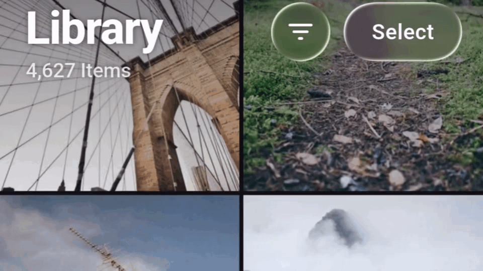
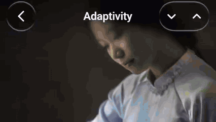
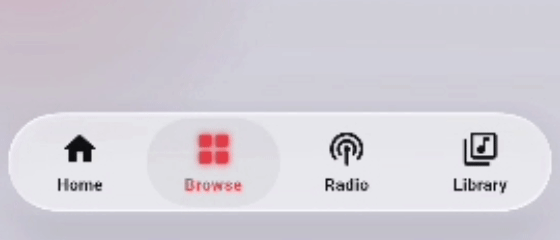
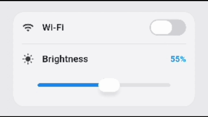
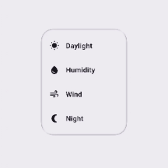

# Liquid Glass Easy

<p align="center">
  <a href="https://pub.dev/packages/liquid_glass_easy"></a>
  <a href="https://pub.dev/packages/liquid_glass_easy/score"></a>
  <a href="https://pub.dev/packages/liquid_glass_easy/score"></a>
  <a href="https://github.com/AhmeedGamil/liquid_glass_easy/blob/main/LICENSE"></a>
</p>

<p align="center">
  <strong>📖 <a href="https://ahmeedgamil.github.io/liquid_glass_easy/">Documentation &amp; live demos</a></strong><br/>
  The full guide, the API reference, and every component running as real liquid glass in your browser — press it, drag it, scroll under it.
</p>

**A Flutter package that brings Apple's iOS-style Liquid Glass to your app with real-time, interactive lenses.**
These dynamic lenses **magnify**, **distort**, **blur**, **tint**, and **refract** the content behind them — recreating the iOS 26 Liquid Glass look with stunning, glass-like effects that respond fluidly to **movement** and **touch**.

<p>
  
</p>

<p>
  
</p>

<p>
  
  
</p>

<p>
  
  
</p>

<p>
  
  
</p>

<p>
  
</p>

---

## Building Blocks

| Block | API | What it does |
|---|---|---|
| **Glass** | `LiquidGlassLens` | The surface itself. Layout-driven — drop it anywhere and it refracts what's behind it. Styled with `LiquidGlassStyle`: shape, appearance, refraction. |
| **Touch** | `LiquidGlassTouch` | How glass answers a finger. Carries `LiquidGlassFlex`: press and it swells, drag and it deforms, release and it springs back. |
| **Motion** | `LiquidGlassLensMotionSpec` | Acceleration-driven deformation for moving glass — it stretches as it launches, squashes as it brakes, and rides undeformed at constant speed. The physics behind the slider thumb and the tab bar's pill (`motion:` on both). |
| **Blend** | `LiquidGlassBlender` | Merges **2–8** lenses into one surface, joined by a smooth metaball bridge. `smoothness: 0` turns the bridge off and keeps the one shared surface — one backdrop read and one material for the whole set, far cheaper than the same lenses standing alone. |
| **Group** | `LiquidGlassGroup` | *Deprecated in 4.3.0* — it is `LiquidGlassBlender(smoothness: 0)` under another name, and it still works. [Docs →](ADAPTIVITY.md#liquidglassgroup--many-lenses-one-surface) |
| **Morph** | `LiquidGlassMorph` | Glass that fits whatever you put in it: swap the child and the surface flows to the new size, as two blobs of one liquid with a neck between them. Motion is a preset. |
| **Lite** | `LiquidGlassLite`, `LiquidGlassEngine`, `LiquidGlassStyle.liteGlass` | The material without the shader: frost, tint and a lit rim, no refraction. Flip one lens, or the whole app per engine — nothing to compile, no capture on Skia, no slot in the lens budget. |
| **Shadow** | `LiquidGlassShadow` | The contact shadow that sets glass *into* the page: a soft ring hugging the rim and pooling beneath, multiplied over whatever is under it. Authored on `appearance.shadow`, where the lens wraps itself in it; usable on its own around anything. |
| **Batch** | `LiquidGlassBatch` | Wrap a subtree and every lens inside it shares **one** read of the backdrop — no limit on how many, each keeping its own shape and style. The group's ceiling and its fusing, traded away for scale. Members must not overlap; `LiquidGlassBatch.exclude` keeps one subtree out. The view and the scaffold batch on their own (`batch: true`). |
| **Adapt** | `LiquidGlassAdaptivity` | Glass tint and content colour flip with the background actually behind each surface — smoked over a dark photo, milky over a white page, and the OS bars along with them. [Docs →](ADAPTIVITY.md) |
| **Scroll edge** | `LiquidGlassScrollEdge` | iOS-style scroll edge treatment: a fading, blurred band pinned to a screen edge so floating chrome stays legible over whatever scrolls under it. Adapts with the background like everything else. |
| **View** | `LiquidGlassView` | The Skia / web background pipeline. Not needed on Impeller. |
| **Components** | `LiquidGlassSlider`, `LiquidGlassSwitch`, `LiquidGlassButton`, `LiquidGlassFab`, `LiquidGlassAppBar`, `LiquidGlassTabBar`, `LiquidGlassAlertDialog`, `LiquidGlassSheet`, `LiquidGlassScaffold`, `LiquidGlassDraggable`, `LiquidGlassMotionPill` | Ready-made controls, each a lens with the blocks above already wired. |
| **Shaders** | `LiquidGlassShaders` | `await LiquidGlassShaders.ensureLoaded()` in `main()` compiles every program — the lens's and the blender's — so the first glass on screen is glass on its first frame. |

---

### Render paths — Impeller, Skia, and the fallback

`LiquidGlassLens` resolves the best path for the engine your app is running on.
The widget tree you write is **identical** in every case:

| Engine / setup | Behavior |
|----------------|----------|
| **Impeller** (Flutter's default on modern iOS/Android) | The lens refracts the **live backdrop** — whatever your app painted behind it. **No `LiquidGlassView` and no background widget needed at all.** Just drop the lens over any UI. |
| **Skia** with an ancestor `LiquidGlassView` (+ `backgroundWidget`) | The lens refracts the view's **captured background**, wherever it sits inside the view's `child`. |
| **Skia** without a view | Refraction isn't possible, so the lens gracefully degrades to a **frosted** look (backdrop blur + tint + border) and logs a one-time debug notice. |
| **Any engine**, lite glass | `LiquidGlassEngine.liteGlassOnSkia` / `liteGlassOnImpeller`, or a `LiquidGlassLitePickup` in `liteGlass` on one style: the lens draws `LiquidGlassLite` — frost, tint and a lit rim — with no shader, no capture and no view needed. |

> In short: **on Impeller it just works anywhere**; on Skia you wrap your
> content in a `LiquidGlassView` to give the lens a background to refract —
> or switch that engine to lite glass and skip the view.

---

### Lite glass — the material without the shader

A lens gets its look from a fragment shader that bends the background under
it. **Lite glass** gives up the bending and keeps everything else: the frost,
the tint, the contact shadow, and a rim lit by the same model the shader
runs, evaluated on the Dart side. Nothing to compile, nothing to warm up, no
capture on Skia, no slot in the lens budget on Impeller.

```dart
// The whole app, per engine — set once, before the first lens builds.
LiquidGlassEngine.liteGlassOnSkia = true;      // Skia and the web
LiquidGlassEngine.liteGlassOnImpeller = true;  // Impeller

// One lens, on either engine — the value is where its rim takes its colour.
LiquidGlassLens(
  style: const LiquidGlassStyle(liteGlass: LiquidGlassLitePickup.backdrop),
  child: child,
)

// The widget itself, on a surface that was never a lens.
LiquidGlassLite(
  shape: const LiquidGlassShape(cornerRadius: 22, borderWidth: 1.5),
  blur: const LiquidGlassBlur(sigmaX: 3, sigmaY: 3),
  color: const Color(0x33FFFFFF),
  child: child,
)
```

The value of `liteGlass` is where the rim takes its colour from, a
`LiquidGlassLitePickup`. `backdrop` is the default: it samples the
background along the rim the way the shader does, for one extra read.
`blend` and `surface` cost no read of their own; `none` is white light. A
lens the engine switches put on lite glass takes its rim from
`LiquidGlassEngine.litePickup` instead, which is `backdrop` by default too.

**What still works, and what does not.** Lite glass changes how a lens is
drawn, not what the tree around it does:

| | Under lite glass |
|---|---|
| Every component | Works the same, with no refraction. The tab bar's `pillStyle.mode: both` is fine on Skia here — there is no capture to double. |
| `touch`, `adaptivity`, `appearance.shadow`, `LiquidGlassScrollEdge` | Work. The adaptive sampler is not a glass capture and keeps running. |
| `LiquidGlassMorph` | Runs as `plain`: one lens, one spring, no second blob. |
| `LiquidGlassBlender` | Does not blend — every member paints solo as its own lite surface. |
| `LiquidGlassBatch` | Inert — there is no shader pass to share. |
| `refraction` | Gone, except `magnification`, which survives as a flat zoom in the frost. |

---

### Touch — glass that answers a finger

Pass a `touch:` and the lens becomes a **soft body**. Press it and it swells
under your finger; drag it and it elongates along the pull, pinches in the
cross axis, leans after your thumb, then springs back with a wobble. The lens
never *moves* — only its shape and its content deform.

<p>
  
</p>

```dart
LiquidGlassLens(
  touch: const LiquidGlassTouch(
    flex: LiquidGlassFlex(),
  ),
  style: const LiquidGlassStyle(
    shape: LiquidGlassShape.continuousRoundedRectangle(cornerRadius: 26),
  ),
  child: myContent,
)
```

`touch` is a **group**, not a single effect: it carries the whole response a
surface has to a finger, so a control's feel travels as one value the way its
whole look travels as a `LiquidGlassStyle`. Today it holds `flex` — the
deformation — and further members land as new fields, not as a new parameter
on every component.

The four edges spring **independently**, so the half nearest your finger
deforms more than the far half — the asymmetry a scale transform cannot
produce. `grip` controls how localized that is (`0` = symmetric wherever you
touch, `1` = fully local), `squeeze` takes the along-axis gain back out of the
cross axis so an elongated lens genuinely gets thinner, and `lean` slides the
body after the finger. `.subtle()`, `.uniform()` and `.pronounced()` are tuned
starting points.

`null` — the default — adds **nothing** to the tree: no gesture listener, no
ticker, no cost.

---

### Blend — fuse lenses into one liquid surface

Wrap **two to eight** `LiquidGlassLens` descendants in a `LiquidGlassBlender` and
their silhouettes merge into a single liquid glass surface: as neighbouring lenses
approach they grow a smooth **metaball bridge**, and they pull apart as you
separate them — each member keeps its own corner style through the merge.

```dart
LiquidGlassView(
  backgroundWidget: myBackground,
  child: LiquidGlassBlender(
    smoothness: 56,
    style: const LiquidGlassStyle(
      shape: LiquidGlassShape.continuousRoundedRectangle(cornerRadius: 36),
    ),
    child: Stack(
      children: const [
        Positioned(left: 40, top: 80, child: SizedBox(width: 120, height: 120, child: LiquidGlassLens())),
        Positioned(left: 120, top: 110, child: SizedBox(width: 100, height: 100, child: LiquidGlassLens())),
      ],
    ),
  ),
)
```

It works on **both backends** — Impeller samples the live backdrop, Skia refracts
the captured background (place it inside a `LiquidGlassView`).

**Eight is the ceiling** — `LiquidGlassBlender.maxLensCount`. The metaball field
compares every member on every fragment, so the cap is what keeps the shader's
cost bounded; it is raised two at a time, by adding a `mat4` to the shader.
Register a ninth lens and it throws in debug; in release the extras are dropped
and the first eight blend.

**One shader for all of them.** Whatever `smoothness` says, the blender draws
every lens under it with a single shader pass — one backdrop read and one
material for the whole set, in place of a pass and a read per lens. That is
what makes it the cheap way to put a set of glass on a screen. At
`smoothness: 0` the bridge is off and the shader skips the smooth-union work
entirely; the members keep their own hard outlines and still share that one
pass. That is exactly what `LiquidGlassGroup` did, and the group is deprecated
in favour of it — `LiquidGlassGroup(...)` is `LiquidGlassBlender(smoothness: 0,
...)`, every other parameter by the same name.

> ⚠️ **A note on blur on Skia.** In-shader blur on the Skia capture path may cost
> **performance** when the lenses are big or the blur is big. Also, **high blur
> (above ~7)** doesn't match the look of a real backdrop blur. It isn't clamped,
> though — the value is left unrestricted so you can push it if you want; just
> expect it to diverge from the Impeller look at high sigmas.

---

### Group — many lenses, one surface

> **Deprecated in 4.3.0.** `LiquidGlassGroup` is `LiquidGlassBlender` with
> `smoothness: 0` as its default and nothing else different; every parameter
> carries over by name. It keeps working and will be removed in a future
> release. Everything below still applies — read `LiquidGlassGroup(...)` as
> `LiquidGlassBlender(smoothness: 0, ...)`.

A page rarely holds one lens, and lenses are not cheap: each one reads the
backdrop behind it and runs its own glass pass. Wrap a set of them in a
`LiquidGlassBlender` with `smoothness: 0` — what the group was — and they are
drawn as **one sheet** with one shader: the members keep their own layout,
shape and child, but give up their individual pass for a single surface
covering all of them.

**This is the cheap way to put a lot of glass on a screen.** Six lenses
standing on their own are six backdrop reads and six materials; the same six in
a blender are **one of each**, whatever they cost to lay out. Reach for it
wherever glass comes in sets — a toolbar of buttons, a stack of cards, a row of
controls.

```dart
LiquidGlassBlender(
  smoothness: 0,   // one shader, one read, no bridge — the group
  style: const LiquidGlassStyle(
    shape: LiquidGlassShape.continuousRoundedRectangle(cornerRadius: 26),
  ),
  child: Column(children: const [
    SizedBox(width: 180, height: 56, child: LiquidGlassLens()),
    SizedBox(height: 12),
    SizedBox(width: 180, height: 56, child: LiquidGlassLens()),
  ]),
)
```

**Fusing is the same knob.** Give `smoothness` a radius instead and members
that come within about half of it flow together through a metaball bridge,
growing as they approach and pulling apart as they separate — the merge in the
Blend section above, on the same shared sheet.

Zero was the only thing the group changed: with it each member keeps its own
hard outline and the shader skips the smooth-union entirely rather than running
it and finding nothing to blend, so a row of buttons or a column of pills pays
nothing for a bridge that never forms.

**Adaptivity stays per member.** Each lens judges the background behind
*itself* and paints its own verdict into the shared sheet; where two fuse,
their colours cross over inside the bridge on the same falloff that shapes it.
A member that isn't adaptive takes the blender's colour.

Two to eight members, on both backends. [Docs →](ADAPTIVITY.md#liquidglassgroup--many-lenses-one-surface)

---

### Adapt — glass that agrees with what's behind it

Glass reads as glass by **agreeing with its backdrop**: smoked over a dark
photo, milky over a white page, with the icons and text on it inverting to
match. Give a style an `adaptivity` and both do it on their own, from the actual
pixels behind that surface.

```dart
LiquidGlassLens(
  style: LiquidGlassStyle(
    adaptivity: LiquidGlassAdaptivity(
      glassColorOnDark: Color(0x33000000),
      contentColorOnDark: Colors.white,
      glassColorOnLight: Color(0x66FFFFFF),
      contentColorOnLight: Color(0xFF1C1C1E),
    ),
  ),
  child: const Icon(Icons.favorite_rounded),   // no colour — it adapts
)
```

Two things flip together, both animated over `duration`: the **glass tint**
(overriding `appearance.color`) and the **content colour**, installed over the
child as an `IconTheme` + `DefaultTextStyle` — so any `Icon` or `Text` that
doesn't hardcode a colour follows automatically.

> **Nothing samples pixels unless a view opts in.** A config says what to do
> with a verdict, not where it comes from: pass `adaptiveSampling` to your
> `LiquidGlassView`, or `adaptivity` to a `LiquidGlassScaffold`, which opens the
> sampler for you. One deliberately tiny capture (pixel ratio `0.05`, 8 per
> second) serves every adaptive surface in the view — ten of them cost one
> capture, not ten.

#### The pieces

| API | What it does |
|---|---|
| `LiquidGlassAdaptivity` | The config — palettes, thresholds, and where the verdict comes from. Goes on `style.adaptivity`. |
| `LiquidGlassAdaptiveArea` | Samples **one** region and hands that verdict to everything inside it, with no wiring. The group form. |
| `LiquidGlassAdaptivityLink` | A channel: an area **publishes** to it, and consumers carrying the same link **follow** it — for followers that can't sit inside the area. |
| `LiquidGlassAdaptivityController` | Pause / resume a whole group, plus `adaptOnce()` to take a single look on your own cue (scroll settled, page entered). |
| `LiquidGlassAdaptiveContent` | Makes bare `Text` / `Icon` — with no glass behind them — adapt like a lens child. |
| `LiquidGlassAdaptiveSampling` | Tuning for the capture that feeds all of it: `pixelRatio`, `frameLimit`, `minimumRegionSamples`. |
| `LiquidGlassScaffoldAdaptivity` | The scaffold's config: palettes for its chrome, plus the strips that drive the system bars. |
| `LiquidGlassSystemChrome` | Which OS bars the verdict also drives — icon brightness only, never bar colours. On a scaffold's config it defaults to the status bar. |
| `LiquidGlassBrightnessFallback` | What to guess when there is nothing to sample: `appTheme` (default) or `platform`. |

`LiquidGlassScrollEdge` runs on the same machine, and so does every drop-in
component: a `LiquidGlassScaffold` hands its `adaptivity` down to the app bar,
the tab bar, the action button and its `lenses`, each of which then judges the
background directly behind **itself**.

**[Full guide → ADAPTIVITY.md](ADAPTIVITY.md)** — how the verdict is decided,
the precedence chain, areas and links, the controller, recipes and gotchas.

---

### What each component needs

On **Impeller** every component refracts the live backdrop and works **anywhere**
with no setup. The difference shows on **Skia**: some refract the *app* content
behind them (so they need an ancestor `LiquidGlassView`), while others supply
their own background and work anywhere on both engines.

| Component | Skia requirement |
|---|---|
| `LiquidGlassSlider` | **None** — self-contained, it owns its background. Works anywhere on both engines. |
| `LiquidGlassSwitch` | **None** — refracts its own track. Works anywhere on both engines. |
| `LiquidGlassScaffold` | **None** — it *is* the pipeline; its child lenses refract the body on both engines. |
| `LiquidGlassButton` | Needs an ancestor `LiquidGlassView` (frosted fallback without one). |
| `LiquidGlassAppBar` | Needs an ancestor `LiquidGlassView`. |
| `LiquidGlassFab` | Needs an ancestor `LiquidGlassView`. |
| `LiquidGlassAlertDialog` | Open it from a context inside a `LiquidGlassView`. |
| `LiquidGlassSheet` | Placed by hand: needs an ancestor `LiquidGlassView`. Presented with `showLiquidGlassSheet`: open it from a context inside one. |
| `LiquidGlassTabBar` | Use it inside a `LiquidGlassScaffold`, which provides the view. For **anywhere on Impeller**, use `LiquidGlassTabBar.withImpeller(...)`. |
| `LiquidGlassDraggable` | Inherits whatever the lens it wraps requires. |
| `LiquidGlassMorph` | It is a blender: needs an ancestor `LiquidGlassView` with a `backgroundWidget`, or the two blobs fall back to two separate lenses and double-refract where they overlap. |
| `LiquidGlassMotionPill` | Inherits whatever its host provides — inside a slider or a tab bar it is already covered; on its own, an ancestor `LiquidGlassView`. |
| `LiquidGlassShadow` | **None** — plain canvas paint, no shader and no capture. Works anywhere on both engines, around anything. |

Under **lite glass** none of them needs a view: there is no capture to feed.

> **Migration note:** the old position-driven lens API (`LiquidGlass`) is
> **no longer used** — it has been replaced by `LiquidGlassLens`. Write new code
> against `LiquidGlassLens` and the drop-in components.
>
> Per-release history lives in [CHANGELOG.md](CHANGELOG.md).

---

## Why Liquid Glass Easy?

Unlike traditional glassmorphism or static blur, **Liquid Glass Easy** simulates
*real glass physics* — complete with **refraction, distortion, and fluid
responsiveness**. It bends live content behind the glass in real time,
producing **immersive, motion-reactive visuals** that bring depth and realism
to your UI.

---

## Features

The systems above are *what* you build with. These are the qualities they all
share:

- **True liquid glass visuals** — real-glass look and physics with fluid transparency, soft highlights, and light-bending refraction.
- **Real-time rendering** — distortion, blur, tint, and refraction react instantly as content moves behind the glass.
- **Custom shapes** — circular rounded rectangles, iOS-style squircles, or Apple-style continuous-corner capsules.
- **Two border modes** — background-tinted `OpticalBorder` (default) or the stylized `ClassicBorder` (deprecated in 4.3.0).
- **Lite glass** — the same material with no shader at all, per lens or per engine, for pages with more glass than the shader budget allows.
- **Shader-driven, GPU-accelerated** — smooth, high-FPS performance.
- **Cross-platform** — Android, iOS, Web, macOS, and Windows.

---

## Installation

```yaml
dependencies:
  liquid_glass_easy: ^4.3.2
```

```bash
flutter pub get
```

Optionally, compile the shaders before the first frame so the very first
lens — or blender — on screen is glass immediately rather than frosted for a
moment:

```dart
Future<void> main() async {
  WidgetsFlutterBinding.ensureInitialized();
  await LiquidGlassShaders.ensureLoaded();
  runApp(const MyApp());
}
```

---

## Getting Started

### 1. The simplest case — a lens, anywhere (Impeller)

On Impeller you don't need a `LiquidGlassView` or a background. Just drop a
`LiquidGlassLens` over your UI:

```dart
import 'package:flutter/material.dart';
import 'package:liquid_glass_easy/liquid_glass_easy.dart';

class DemoGlass extends StatelessWidget {
  const DemoGlass({super.key});

  @override
  Widget build(BuildContext context) {
    return Scaffold(
      body: Stack(
        fit: StackFit.expand,
        children: [
          Image.asset('assets/bg.jpg', fit: BoxFit.cover),
          Center(
            child: SizedBox(
              width: 260,
              height: 150,
              child: LiquidGlassLens(
                style: const LiquidGlassStyle(
                  shape: LiquidGlassShape.squircle(cornerRadius: 44),
                  refraction: LiquidGlassRefraction(
                    distortion: 0.13,
                    distortionWidth: 34,
                  ),
                ),
                child: const Center(child: Text('Liquid Glass')),
              ),
            ),
          ),
        ],
      ),
    );
  }
}
```

### 2. The Skia path — wrap in a `LiquidGlassView`

To make refraction work on Skia, give the lens a background to
refract by placing it inside a `LiquidGlassView.child`:

```dart
LiquidGlassView(
  backgroundWidget: const MyBackground(), // required on Skia
  child: Center(
    child: SizedBox(
      width: 300,
      height: 160,
      child: LiquidGlassLens(
        style: const LiquidGlassStyle(
          shape: LiquidGlassShape.squircle(cornerRadius: 40),
          refraction: LiquidGlassRefraction(distortion: 0.12, distortionWidth: 30),
        ),
        child: const Center(child: Text('refracts the captured background')),
      ),
    ),
  ),
)
```

The exact same `LiquidGlassLens` code refracts the live backdrop on Impeller and
the captured `backgroundWidget` on Skia — no changes required.

### Explore interactively

You can find the demos shown above under the [`example/`](example/) folder.

---

## Core API

### `LiquidGlassLens`

```dart
LiquidGlassLens({
  LiquidGlassStyle style = const LiquidGlassStyle(),
  bool visibility = true,        // instant show/hide; hidden = no backdrop cost
  bool? useImpellerBackdrop,     // override engine auto-detection
  Widget? child,                 // clipped to the lens shape
})
```

Size comes from layout — wrap it in a `SizedBox` (or let its child/constraints
size it). The `child` is always clipped to the full lens shape; add your own
`Padding` to inset it.

### `LiquidGlassStyle`

```dart
LiquidGlassStyle({
  LiquidGlassShape? shape,                // null → default continuous rounded rect
  LiquidGlassAppearance appearance = const LiquidGlassAppearance(),
  LiquidGlassRefraction refraction = const LiquidGlassRefraction(),
})
```

`copyWith(...)` and `merge(other)` are provided for theme/override patterns.

#### `LiquidGlassRefraction`

| Property | Default | Description |
|----------|---------|-------------|
| `distortion` | `0.1` | Bending strength of the distortion (`0.0`–`1.0`). |
| `distortionWidth` | `30` | Thickness of the distortion band around the perimeter, in px. |
| `magnification` | `1.0` | Magnification of content seen through the lens (`1.0` = none). |
| `chromaticAberration` | `0.003` | Color-channel separation; `0.0` disables it. |
| `refractionMode` | `shapeRefraction` | `shapeRefraction` (follows shape contours) or `radialRefraction` (circular pattern). |

#### `LiquidGlassAppearance`

| Property | Default | Description |
|----------|---------|-------------|
| `color` | `transparent` | Base tint of the lens (often semi-transparent). |
| `blur` | `LiquidGlassBlur()` | Blur applied to content beneath the glass. |
| `saturation` | `1.0` | `1.0` = unchanged, `0.0` = grayscale. |
| `enableInnerRadiusTransparent` | `false` | Whether the inner, non-distorted region is transparent. |
| `shadow` | `null` | Contact shadow (`LiquidGlassShadow`) the lens wraps itself in — part of the material, so it travels wherever the style goes. Components take their shadow from here, never as a separate parameter. |

#### `LiquidGlassShape`

Pick a corner curve via a convenience constructor:

| Constructor | Corner style |
|-------------|--------------|
| `LiquidGlassShape.roundedRectangle(...)` | Plain **circular** corners (cheapest). |
| `LiquidGlassShape.squircle(...)` | **L^n squircle** — iOS-style continuous curvature. |
| `LiquidGlassShape.continuousRoundedRectangle(...)` | **Apple capsule-style** continuous corners (**default**; collapses to a clean capsule at full radius). |

Common parameters: `cornerRadius`, `borderWidth`, `borderColor`, `lightColor`,
`lightIntensity`, `lightDirection`, `borderType`, and `clipQuality`
(`roundedRectangle` = cheap circular clip, `exact` = shape-matched `ClipPath`).

> **Tip — choosing `clipQuality`:**
> - **`squircle`:** it's worth using `LiquidGlassClipQuality.exact`. The squircle
>   has its own shader-matched `ClipPath`, so `exact` makes the clipped child/blur
>   silhouette follow the true L^n curve instead of a plain rounded rectangle.
> - **`continuousRoundedRectangle`:** leave `clipQuality` at its default
>   (`roundedRectangle`). A rounded-rectangle clip already hugs the continuous
>   corner so closely that there's effectively **no visible difference** from the
>   `exact` continuous clipper — that continuous clipper is only there as an
>   experiment, and `exact` just adds an extra (more expensive) save layer for no
>   real gain. Only reach for `exact` here if you can actually *see* the clipped
>   edge not lining up with the refraction.

### `LiquidGlassView` (Skia background provider)

```dart
LiquidGlassView({
  required Widget backgroundWidget,  // refracted by lenses on Skia
  Widget? child,                     // your UI, containing LiquidGlassLens widgets
  double pixelRatio = 1.0,
  bool realTimeCapture = true,
  bool useSync = true,
  bool? useImpellerBackdrop,
  LiquidGlassRefreshRate refreshRate = LiquidGlassRefreshRate.deviceRefreshRate,
  LiquidGlassAdaptiveSampling? adaptiveSampling,  // null = no background sampling
})
```

> `adaptiveSampling` is the switch that lets adaptive surfaces read the pixels
> behind them — nothing samples without it. `LiquidGlassScaffold` opens it for
> you from its own `adaptivity`. See [ADAPTIVITY.md](ADAPTIVITY.md#turning-sampling-on).

---

## Border Modes

Every shape renders its border in one of two styles through `borderType`.

| Mode | Description |
|------|-------------|
| `ClassicBorder` | *Deprecated in 4.3.0.* Light/shadow colors sweep around the shape based on the angle between the surface normal and the light direction. Clean, stylized, direct color control. Still works; shape the optical rim with `borderSaturation`, `ambientIntensity`, `borderSolidity` and `lightSpread` instead. |
| `OpticalBorder` | **(default)** An Apple-style, SDF-based rim light that emerges as an optical consequence of the glass shape — background-tinted highlights, dual-sided specular reflections, and a lens height profile. The rim color adapts to whatever sits behind the lens. |

### Optical Border

```dart
LiquidGlassLens(
  style: const LiquidGlassStyle(
    shape: LiquidGlassShape.squircle(
      cornerRadius: 36,
      borderType: OpticalBorder(
        borderSaturation: 1.5,
        ambientIntensity: 1.0,
        borderSolidity: 0.0,
      ),
    ),
  ),
)
```

| Property | Description |
|----------|-------------|
| `borderSaturation` | Saturation of the border color. `0.0` grayscale, `1.0` unchanged (default), `>1.0` more vivid. Range `0.0`–`3.0`. |
| `ambientIntensity` | Ambient rim contribution, keeping it visible on the shadow side. `1.0` default. Range `0.0`–`5.0`. |
| `borderSolidity` | How far `lightIntensity` can push the rim toward opaque. `0.0` translucent (default) → `1.0` solid. |

### Classic Border

```dart
LiquidGlassLens(
  style: const LiquidGlassStyle(
    shape: LiquidGlassShape.roundedRectangle(
      lightColor: Color(0xB2FFFFFF),
      borderType: ClassicBorder(
        borderSoftness: 2.5,
        shadowColor: Color(0x1A000000),
      ),
    ),
  ),
)
```

| Property | Description |
|----------|-------------|
| `borderSoftness` | Feathered edge transition. Higher = softer. Defaults to `1.0`. |
| `shadowColor` | Shadow color on the opposite side of the border for depth. Defaults to `Color(0x1A000000)`. |

---

## Common Patterns

### Draggable lens

```dart
LiquidGlassDraggable(
  child: SizedBox(
    width: 200,
    height: 200,
    child: LiquidGlassLens(
      style: const LiquidGlassStyle(
        shape: LiquidGlassShape.roundedRectangle(cornerRadius: 100),
        refraction: LiquidGlassRefraction(distortion: 0.2, magnification: 1.1),
      ),
      child: const Center(child: Text('drag me')),
    ),
  ),
)
```

### Show / hide

`visibility: false` disables the glass instantly (no backdrop cost) and removes
the child, leaving nothing behind. Wrap the lens yourself to animate the
transition:

```dart
LiquidGlassLens(visibility: _visible, style: myStyle, child: content)
```

### Lenses inside scrollables

> **Not recommended.** Liquid glass is designed to **float above** your content
> — a fixed lens (a bottom bar, a floating panel, a control overlay) that
> refracts the scrolling content passing *behind* it. Putting the lens *inside*
> the scrollable, so it scrolls with the list, fights that concept and runs into
> the overscroll limit below. Prefer a floating lens layered over the list (e.g.
> in a `Stack`) instead of a lens placed as a list item.

### Lenses inside scrollables, during overscroll (Impeller)

While you pull past the end of a list, Android's stretch overscroll wraps the
whole scrollable in an `ImageFiltered` — it renders into its own texture and
distorts that. A lens inside it keeps its **place**: the glass and its sampling
are measured from that texture rather than from the window, so the shape stays
under its own outline and refracts what is actually behind it.

What the texture does **not** contain is the page behind the scrollable, only
what the scrollable itself painted. So for the length of the pull, a lens
refracts its list and nothing else — one with empty list behind it reads
**black** until the pull springs back.

If that matters, drop the indicator for scrollables that contain lenses; the
list then simply stops at its end, with no stretch and no isolated layer:

```dart
ScrollConfiguration(
  behavior: const MaterialScrollBehavior().copyWith(overscroll: false),
  child: ListView(children: [ /* ...LiquidGlassLens... */ ]),
)
```

---

## Drop-in Components

```dart
// A glass slider — the thumb lifts into clear glass under your finger
// and deforms from acceleration as it travels.
LiquidGlassSlider(
  value: volume,
  onChanged: (v) => setState(() => volume = v),
  width: 320,
);

// A glass switch.
LiquidGlassSwitch(
  value: wifi,
  activeColor: const Color(0xFF0A84FF),
  onChanged: (v) => setState(() => wifi = v),
  width: 63,
  height: 28,
);
```

Both size themselves, so a `SizedBox` around one does nothing — give
them `width` / `height` instead. Those two are a shorthand for the same
fields on `layout`, which is where the rest of the geometry lives (the
thumb's resting and lifted sizes, the track thickness, the end icons).

Both also ship the tuned look out of the box, exposed as
`LiquidGlassSlider.defaultStyle` / `LiquidGlassSwitch.defaultStyle`: a
**clear** thumb — refraction and a soft rim, no tint — with a tucked-in
contact shadow riding `defaultStyle.appearance.shadow`. Change one facet
without retyping the rest
(`style: LiquidGlassSlider.defaultStyle.copyWith(refraction: …)`), or
hand over an appearance carrying no shadow to drop the shadow.

Each component is self-contained and styled through the same
`LiquidGlassStyle` vocabulary. Other components: `LiquidGlassButton`,
`LiquidGlassFab`, `LiquidGlassAppBar`, `LiquidGlassTabBar`,
`LiquidGlassAlertDialog`, `LiquidGlassSheet`, `LiquidGlassScaffold`,
`LiquidGlassMorph`, `LiquidGlassShadow`, and `LiquidGlassMotionPill` — the
slider's living thumb on its own, for anything that moves a glass capsule
along a path.

### Shadow — the contact shadow

`LiquidGlassShadow` is what makes a glass pill read as sitting *in* the
surface rather than floating flat on it: a soft dark band that hugs the rim
and pools underneath. It is cast by a **ring** straddling the outline —
not by the pill itself — displaced downward and blurred, so one shape gives
both the inner rim contact and the drop below while the middle of the glass
stays clear. It composites with `multiply`, darkening the glass inside and
the page outside instead of laying grey over both.

The place to author it is the style — `appearance.shadow` — and every lens
and component takes it from there, never as a separate parameter:

```dart
LiquidGlassLens(
  style: const LiquidGlassStyle(
    appearance: LiquidGlassAppearance(
      shadow: LiquidGlassShadow(blur: 3.5, opacity: 0.2),
    ),
  ),
  child: child,
)

// The slider's and the switch's tuned shadow lives on their defaultStyle;
// hand over an appearance carrying no shadow to drop it.
```

On its own it is a plain **parent** widget — `LiquidGlassShadow(child: …)`
— that paints behind whatever it wraps and never touches it, so it composes
with any lens or any surface. Wrap the lens; a shadow passed as *content*
would be clipped to the outline and lose the half that pools below, which
is the half that reads as contact. `blur`, `opacity`, `color`, `offset`
(`blur + 2` downward by default), `cornerRadius` (capsule by default) and
`inset` — how far inside the glass the casting ring sits, for a tighter
contact on a small control — are the knobs. Under a `touch`, the ring
follows the deformed outline. Not supported inside a `LiquidGlassBlender`:
a merged silhouette has no single ring to cast.

### Sheets — Flutter's bottom sheet, in glass

`showLiquidGlassSheet` **is** `showModalBottomSheet`: same route, same
slide-up, same drag-to-dismiss, same barrier — with the glass put where
its filled `Material` used to be. Every parameter of Flutter's is
forwarded (`isScrollControlled`, `constraints`, `isDismissible`,
`enableDrag`, `useSafeArea`, `transitionAnimationController`, …), and the
look is the usual `LiquidGlassStyle`.

```dart
showLiquidGlassSheet<String>(
  context: context,
  header: const Padding(
    padding: EdgeInsets.fromLTRB(20, 2, 20, 12),
    child: Text('Share', style: TextStyle(fontSize: 22, fontWeight: FontWeight.w700)),
  ),
  style: LiquidGlassSheet.defaultStyle.copyWith(
    appearance: const LiquidGlassAppearance(color: Color(0x30FFFFFF)),
  ),
  builder: (context) => Column(
    mainAxisSize: MainAxisSize.min,
    children: [ ... ],
  ),
);
```

`LiquidGlassSheet` on its own is just the surface — the glass, a
`grabber`, a full-width `header` and the padded child. It takes the
height it is given and hugs its content when given none, so it drops
into anything that owns the motion. That is how you get an **expandable**
sheet: put the panel inside `DraggableScrollableSheet`'s builder, where
it resizes along with it.

```dart
showModalBottomSheet(
  context: context,
  backgroundColor: Colors.transparent,
  isScrollControlled: true,
  builder: (context) => DraggableScrollableSheet(
    expand: false,
    initialChildSize: 0.5,
    snap: true,
    snapSizes: const [0.5, 0.94],
    builder: (context, scrollController) => LiquidGlassSheet(
      child: ListView(controller: scrollController, children: [ ... ]),
    ),
  ),
);
```

`anchor` picks the shape: `floating` (the default) insets the sheet on
all sides and rounds all four corners, while `attached` runs it full
width along the bottom edge — built taller than it is, with the extra
hanging off the screen, so the bottom corners are never in frame and no
sliver of page shows underneath. `avoidKeyboard` (on by default) adds
the bottom `viewInsets` padding you would otherwise write in every
builder, so a sheet with a text field in it rides the
keyboard up — give it `isScrollControlled: true` for the room to do so.

### Morph — glass that fits whatever you put in it

Swap the child; the glass measures the new one and flows to its size. You
never type a dimension:

```dart
LiquidGlassMorph(
  alignment: Alignment.bottomRight,
  child: open
      ? const Menu(key: ValueKey('menu'))
      : const Icon(Icons.more_horiz, key: ValueKey('dots')),
)
```

That is the whole API. Add a row to `Menu` and the glass grows to match —
there is one truth about how big the menu is, and the glass reads it instead
of being told it a second time. `Key` is the identity: a child that keeps its
type without a key is not seen as new, and will neither cross-fade nor be
re-measured.

`width` and `height` are **overrides**, not inputs. Set one and that axis is
pinned while the other is still measured — the fixed-width menu whose height
follows its rows. Set both and nothing is measured at all.

It is not an `AnimatedContainer`. The morph is **two blobs of one liquid**,
drawn as a single surface by `LiquidGlassBlender`: the destination blob
carries the new shape and content, the source blob the old, and the smooth
union joins them — so mid-morph the outline has a **waist**, the one thing a
tween can never produce. Growing, the new blob's centre leaps ahead and its
size catches up, pulling a neck out of the source; shrinking is the same film
run backwards. Each blob keeps its own corners, the old child blurs out in the
first 40% of the swap and the new one blurs in over the second half, pinned
where the glass will finally sit. At rest the two blobs coincide and the union
is off, so the resting outline is the plain shape. `smoothness` is the neck
radius, the same quantity as the blender's.

**`alignment` is the parameter people regret.** The widget fills the box it is
given and places the glass inside it, because a size alone does not say which
way a surface should grow. `centerLeft` holds the left edge and opens
rightward; `bottomRight` holds that corner and opens up and left; `center`
moves both edges — which looks right in every direction, and is exactly why
getting it wrong stays invisible until the surface walks across the screen.
Any `Alignment(x, y)` is valid, not just the nine names. If the surface is
positioned by something that isn't an alignment — a `Positioned`, a list, a
drag — recover the one its own rect implies:

```dart
alignment: LiquidGlassMorph.alignmentFor(cardRect, pageRect),
```

**Motion** is a preset:

```dart
motion: LiquidGlassMorphMotion.fluid        // the default: leaps and drags a neck
motion: LiquidGlassMorphMotion.anchoredPop  // pops open from the corner that holds
motion: LiquidGlassMorphMotion.droplet      // born small, leaps hard, long neck
motion: LiquidGlassMorphMotion.calm         // no bounce, for sheets and large cards
```

Behind them are three numbers — the spring (`spring(duration:bounce:)`
takes a SwiftUI `Spring` straight from a design spec), `stretch` (how far the
leading blob runs ahead of its own size) and `anchor` (the point the new shape
grows around; `null` uses the widget's own `alignment`). Everything set once
and left alone is in `LiquidGlassMorphAdvanced`, behind `advanced`.

Two things to know. A content-sized surface needs one frame to measure before
it knows how big it is, so it is transparent for that frame; pin both axes and
there is no warm-up frame. And bound the constraints — under unbounded ones
there is no box to anchor inside, so put it in a `Stack`, a `SizedBox` or a
`Padding` inside one. The style's shape is the destination's; border, light,
tint, blur and refraction pass through to the blender untouched.

### Tab bar — the moving glass pill

`LiquidGlassTabBar`'s selection pill is real glass on **every renderer**
by default: it lifts off the tab the moment you tap, travels on a spring
— stretching as it launches, squashing as it brakes — and refracts the
bar's own capsule as it passes. A settled bar costs no shader pass at
all. The tier is chosen by `LiquidGlassTabPillStyle.mode` (`both` /
`impellerOnly` / `none`), and the pill's look, motion and contact shadow
are tuned defaults — the shadow authored, like every lens's, on its glass
style's `appearance.shadow` (the bar capsule's likewise on the bar
`style`'s appearance).

> **`both` on Skia.** With the shader, the pill on Skia captures the page a
> second time on top of the bar's own capture — heavy over anything that
> moves, so `impellerOnly` is the setting to ship there. Under **lite glass**
> (`LiquidGlassEngine.liteGlassOnSkia = true`, or `liteGlass` set on the
> bar's styles) that cost is gone: the view takes no capture at all, the pill
> is a frosted capsule on the same spring, and `both` runs on Skia with no
> performance issue. On Impeller there is no capture either way.

The tab **under** the pill is its own state: `underGlassIconSize` and
`underGlassLabelFontSize` on `LiquidGlassTabItemStyle` let the icon and
label render bigger while the glass is over them. The enlargement is the
glass's effect, not the selection's — it rides under the pill for the
whole travel and glides back down through the landing.

### Custom icons & labels — SVG, PNG, rich text, anything

Tabs aren't limited to `IconData`. Give `LiquidGlassTabBarItem` an
`iconBuilder` instead of an `icon` and the glyph is drawn through your
builder, so any widget works — an `SvgPicture`, an `Image`, a
`CustomPaint`:

```dart
LiquidGlassTabBarItem(
  label: 'Home',
  iconBuilder: (context, i) => SvgPicture.asset(
    i.selected ? 'assets/home_fill.svg' : 'assets/home.svg',
    width: i.size,
    height: i.size,
    colorFilter: ColorFilter.mode(i.color, BlendMode.srcIn),
  ),
);
```

The builder is handed the color the bar already resolved for the layer it
is drawing, the glyph box size, and whether that layer is the selected
one. Tint with `i.color` and your artwork follows the selected /
unselected palette **and** the morph pill's reveal — the glass-pill bar
draws each tab twice per frame, once inside the pill and once outside it,
and calls the builder for each. Multi-colour art can simply ignore the
colour. `LiquidGlassButton` and `LiquidGlassTabBarAction` take a `child`
for the same reason.

Labels have the same escape hatch: `labelBuilder` draws the label line
instead of the plain `Text` — a custom font, rich text, a badge row. It
receives the already-resolved `textStyle` (color, size, weight) for the
layer being drawn, so `copyWith` keeps the stock look and changes only
what you need — and like `iconBuilder` it runs once per rendered layer,
so a custom label follows the pill's reveal too:

```dart
LiquidGlassTabBarItem(
  icon: Icons.inbox_rounded,
  label: 'Inbox',
  labelBuilder: (context, l) => Row(
    mainAxisSize: MainAxisSize.min,
    children: [
      Text(l.text!, style: l.textStyle),
      const SizedBox(width: 3),
      Container(
        width: 6,
        height: 6,
        decoration: const BoxDecoration(
          color: Colors.red,
          shape: BoxShape.circle,
        ),
      ),
    ],
  ),
);
```

### Tab bar — standalone with `.withImpeller`

`LiquidGlassTabBar` shows its animated, glass-refracting **morph
selection pill** when it's driven by a `LiquidGlassScaffold`, which owns the
capture pipeline and hands the bar the page as its background.

To use the bar **on its own** — no `LiquidGlassScaffold` and no `body` to pass
— use the **`.withImpeller`** constructor. On Impeller the bar and its morph
pill sample the live backdrop, so just drop it as the last child of a `Stack`
over your page:

```dart
Stack(
  children: [
    MyPage(),
    LiquidGlassTabBar.withImpeller(
      items: items,
      selectedIndex: index,
      onChanged: (i) => setState(() => index = i),
    ),
  ],
);
```

> `.withImpeller` is **Impeller-first**: on Skia (no live-backdrop
> shader) it falls back to a plain frosted bar that still shows the content
> behind it. For the refracting morph pill on Skia, use a
> `LiquidGlassScaffold` with a real `body`.

---

## Snapshot vs Realtime (Skia capture)

When you use a `LiquidGlassView` on Skia, choose how its background is
captured:

| Mode | When to Use | Config |
|------|-------------|--------|
| **Realtime** | Moving backgrounds (scrolling, video) | `realTimeCapture: true` |
| **Snapshot** | Static backgrounds | `realTimeCapture: false` + `viewController.captureOnce()` |

```dart
final viewController = LiquidGlassViewController();

LiquidGlassView(
  controller: viewController,
  backgroundWidget: const MyBackground(),
  realTimeCapture: false,
  child: const MyGlassUI(),
);

// Refresh manually after the background changes:
await viewController.captureOnce();
```

> On **Impeller** the lens reads the live backdrop directly, so capture settings
> don't apply — these are a Skia concern.

---

## Recommended Settings (Skia capture)

- **General use:** `useSync: true`, `pixelRatio: 0.8–1.0`
- **Performance-focused:** `useSync: false`, `pixelRatio: 0.5–0.7`

> For full-screen backgrounds, `pixelRatio` of 0.5–1.0 balances performance and
> detail. Smaller regions can afford higher ratios for sharper glass. The final
> choice depends on the device.

---

## License

**MIT License**

---

## Developed by

**Ahmed Gamil**

Feel free to open issues or contribute to the project!
